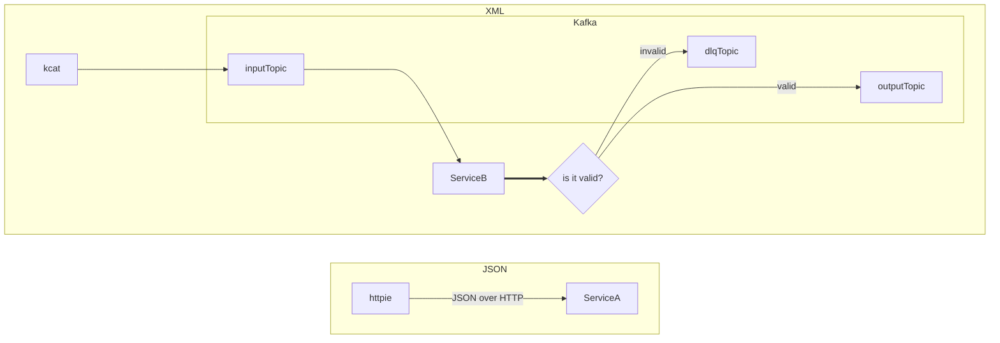

# Schema Registry Demo



## Preparing
You have to add some entries to your ```/etc/hosts``` file:
```
127.0.0.1            keycloak
127.0.0.1            kafka
127.0.0.1            schema-registry
```
That's needed for host resolution because Kafka brokers and Kafka clients connecting to Keycloak have to use the same hostname to ensure the compatibility of generated access tokens. Also, when Kafka client connects to Kafka broker running inside docker image, the broker will redirect the client to ```kafka:9092```.

## Start environment
1. Clone https://github.com/stn1slv/docker-envs repo
```
git clone https://github.com/stn1slv/docker-envs
```
2. Use root directory of the repo
```
cd docker-envs
```

### Cleanup
```
docker rm keycloak kafka zookeeper schema-registry sr-init kc-init
```

### Start Keycloak
```
docker-compose -f compose.yml -f keycloak/compose.yml -f keycloak/initializer.yml up
```

### Start Apicurio Registry
```
docker-compose -f compose.yml -f apicurio-registry/compose-oidc.yml -f apicurio-registry/initializer.yml up
```

### Start Kafka
```
docker-compose -f compose.yml -f kafka/compose-cp.yml up
```

## Start demo applications
1. Clone this repository
```
git clone https://github.com/stn1slv/schema-registry-demo
```
2. Use root directory of the repo
```
cd schema-registry-demo
```

3. Start ServerA app
```
mvn clean spring-boot:run -f ServerA/pom.xml
```
4. Start ServerB app
```
mvn clean spring-boot:run -f ServerB/pom.xml
```

## Testing
### Send message to Kafka
```
kcat -P -b 127.0.0.1 -t input examples/purchaseOrderV1_Alice.xml
```

```
kcat -P -b 127.0.0.1 -t input examples/purchaseOrderV1_John.xml
```

### Send message via http endpoint

```
cat examples/purchaseOrderV1_Alice.json | http POST 'http://localhost:8085/doSomething' Content-Type:'application/json'
```

```
cat examples/purchaseOrderV1_John.json | http POST 'http://localhost:8085/doSomething' Content-Type:'application/json'
```

#### Monitor messages in DLQ topic
```
kcat -b 127.0.0.1 -t dlq -f '\nKey: %k\t\nHeaders: %h \t\nValue: %s\\n--\n'
```

#### Monitor messages in Output topic
```
kcat -b 127.0.0.1 -t output
```
